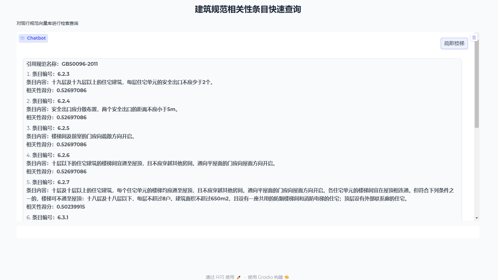

  ### 建筑规范向量化数据库
灵感来源 https://github.com/wxywb/history_rag 类似于根据海量文档内容去查证一个很碎片化的信息

  ### 方案构想：
利用本地`bce-embedding-base_v1作为嵌入模型，对建筑常用规范条目进行向量化并存储为本地向量数据库，实现RAG的业务语义查询得逻辑。
  ### 实现效果：

  ##### 这里做简单示例，根据关键字在向量文档上下文进行语义查询，与以前纯文本匹配的方式相比，靠前的召回基本都涵盖关键字，而靠后能召回关键字条目上下文附近的可能相关的内容。

  ### 使用场景&要解决问题：
```bash
-建筑师经常需要在多部相关的规范条目中寻找某个主题的相关规范内容（比如：‘疏散楼梯’等），这些内容相对分布零散且用书籍查询效率很低。
-针对某种类型建筑一般有专门的规范，第一次接触会比较陌生，查询起来很容易产生疏漏。
-可以根据需要补充或更新规范向量数据库
```

  ### 项目使用工具
```bash
> 智普大模型的API接口
> FAISS向量数据库
> Langchain相关包
> 嵌入模型 ‘bce-embedding-base_v1’
> gradio、uvicorn 用于构建web可视化应用
```

  ### 文件说明
  main.py 文件可以根据原始txt文档生成新向量数据库，并将其存储在vectorStore文件夹下，并进行查询

  local_query.py文件可以读取vectorStore文件夹下，已有的向量数据库进行查询

  call_larg_model.py时调用大模型的接口文件，可根据需要修改其他厂商的API接口
  
  ### 向量库说明
   示例的向量化文件已包含：
  
  《建筑设计防火规范》GB50016-2014(2018年版) chunk：200

  《住宅设计规范》GB50096-2011 chunk：200

   ##### 注：目前向量模型为bge-embedding-base_v1
